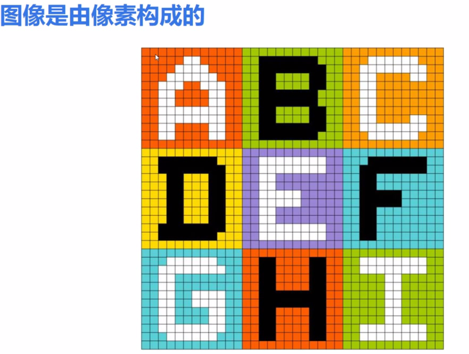
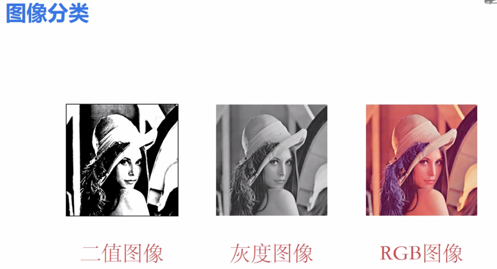
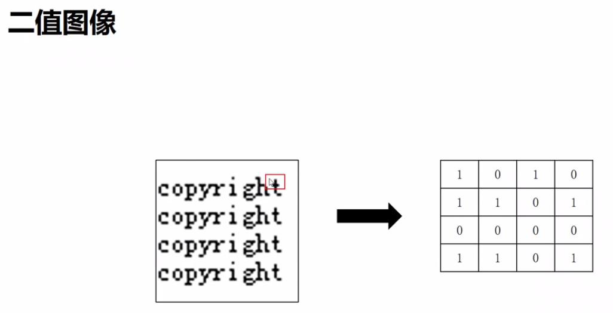
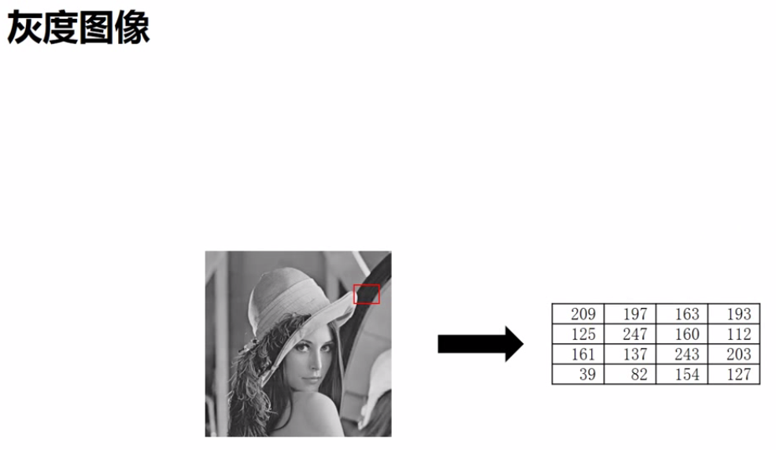
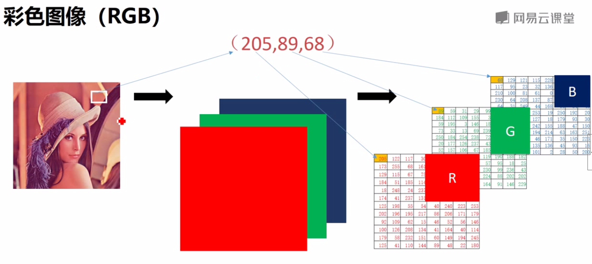
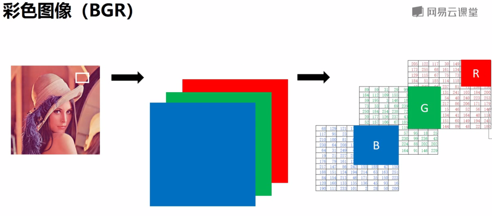
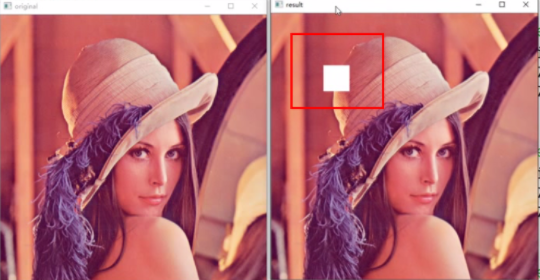

# 图像处理基础（一）

* **什么是像素？**



* **图像的种类都有哪些？**

二值图像、灰度图像、RGB图像











**一、像素处理（opencv直接读取像素）** 

读取像素：返回值=图像\[位置参数\] 

说明：灰度图像返回灰度值；彩色图像返回R、G、B值 

示例： 灰度图像 P=image\[55,69\]         彩色图像 P=image\[55,69，0/1/2\] 

                              print（P）                                   print（P） 

修改像素值：像素=数值 

示例：灰度图像 image\[55,69\]=236        彩色图像 image\[55,69,0/1/2\]=236     

                             print（image\[55,69\]）                 print（image\[55,69\]）

```text
...程序示例（灰度图像）...

import cv2
i=cv2.imread("e:\\lesson\\image\\lena.bmp",cv2.IMREAD_UNCHANGED)
print(i[100,100])
i[100,100]=255
print(i[100,100])

运行结果：
73
255
```

```text
...程序示例（彩色图像）...

import cv2
i=cv2.imread("e:\\lesson\\image\\lenacolor.png",cv2.IMREAD_UNCHANGED)
print(i[100,100])
i[100,100,2]=255
print(i[100,100])

运行结果：
[78 68 178]
[78 68 255]
```

```text
...程序示例（修改多个像素）...

import cv2
i=cv2.imread("e:\\lesson\\image\\lenacolor.png",cv2.IMREAD_UNCHANGED)
cv2.imshow("original",i)
i[100:150,100:150]=[255,255,255]
cv2.imshow("result",i)
cv2.waitkey()
cv2.destroyAllWindows()
```






